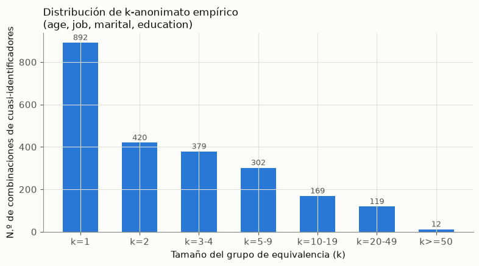
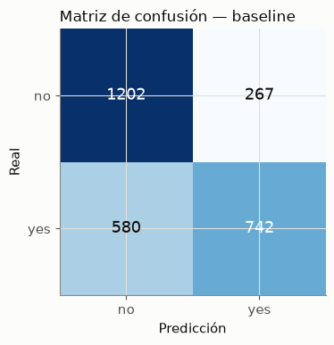
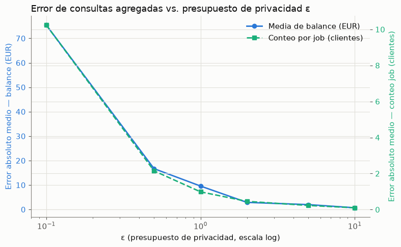
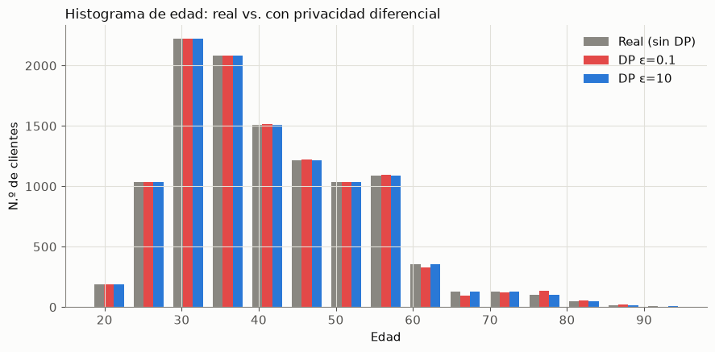
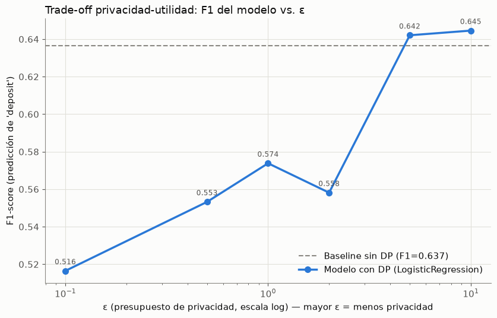
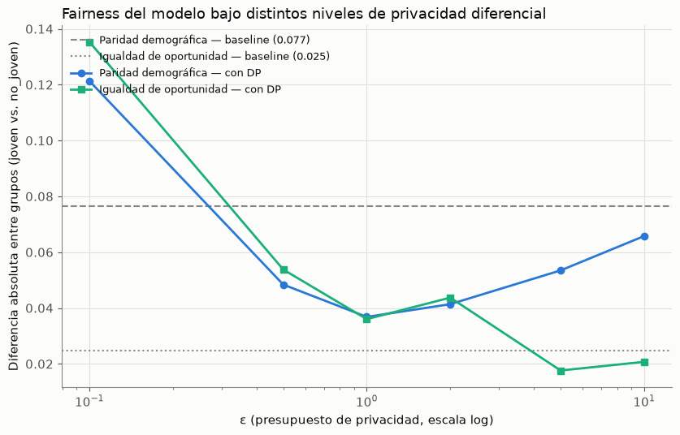

# Privacidad Diferencial en el Sistema de Apoyo a Campañas Bancarias

**DS3031 — Ética y Seguridad de Datos — UTEC — Entrega Final**

**Grupo 1:** Mora Huamanchay, Angel Obed (202010031) · Surco Vergara, Maria Fernanda (202110358) · Villarreal Falcon, Mishelle Stephany (202010177)

---

## Índice

1. [Introducción](#1-introducción)
2. [Marco legal y normativo aplicable](#2-marco-legal-y-normativo-aplicable)
3. [Recapitulación del caso de negocio y el dataset](#3-recapitulación-del-caso-de-negocio-y-el-dataset)
4. [Evaluación de Impacto en la Protección de Datos (DPIA)](#4-evaluación-de-impacto-en-la-protección-de-datos-dpia)
5. [Metodología de privacidad diferencial](#5-metodología-de-privacidad-diferencial)
6. [Resultados experimentales](#6-resultados-experimentales)
7. [Reflexión ética](#7-reflexión-ética)
8. [Conclusiones y limitaciones](#8-conclusiones-y-limitaciones)
9. [Referencias](#9-referencias)

---

## 1. Introducción

La entrega parcial de este proyecto —*"Sistema seguro de apoyo a campañas bancarias con
privacidad de datos"*, calificada 10/10— abordó el caso de negocio del **Bank Marketing
Dataset** (Moro et al., 2014) desde la óptica de la **seguridad de la información**: cifrado
AES-256-GCM de datos personales, hashing Argon2id de contraseñas, control de acceso basado en
roles (RBAC) y registros de auditoría. Esas medidas responden a la pregunta *"¿quién puede
acceder a qué dato, y queda registro de ello?"*. Esta entrega final responde una pregunta
distinta y complementaria: **¿qué se puede inferir sobre un cliente incluso cuando nadie accede
directamente a la base de datos, sino solo a un reporte agregado o a un modelo entrenado sobre
ella?**

El propio informe parcial anticipó este vacío. En su sección de recomendaciones futuras
(§10.8, punto 6) se señalaba explícitamente:

> *"Aplicación de técnicas de privacidad diferencial en reportes agregados."*

Este informe, junto con el notebook `notebooks/01_privacidad_diferencial.ipynb` que lo
sustenta, desarrolla esa recomendación. Se mantiene intacta la capa de seguridad ya construida
(el backend con RBAC, cifrado y auditoría sigue funcionando exactamente igual) y se añade una
capa nueva y ortogonal: protección de la información que el sistema *libera* como estadística
agregada o como salida de un modelo de priorización de clientes, aplicando **privacidad
diferencial (DP)** con la librería **IBM diffprivlib** (Holohan et al., 2019).

El documento está organizado en tres bloques. Primero, una **DPIA formal** (Evaluación de
Impacto en la Protección de Datos) que identifica y evalúa los riesgos específicos de este
tratamiento bajo la normativa peruana vigente. Segundo, la **metodología y los resultados
experimentales** de aplicar DP sobre `bank.csv`: cuánto ruido hace falta, cuánta utilidad se
pierde, y qué pasa con la equidad del sistema. Tercero, una **reflexión ética** que conecta
estos hallazgos con los casos discutidos en el curso (Gender Shades, COMPAS, Toeslagenaffaire,
el teorema de imposibilidad de Kleinberg) y con las decisiones concretas de diseño tomadas en
este sistema.

---

## 2. Marco legal y normativo aplicable

Esta sección recicla y adapta el marco legal ya desarrollado en el informe parcial (§8),
reenfocándolo hacia las obligaciones que activa específicamente la **publicación de agregados y
modelos** derivados de datos personales, más allá del acceso directo a la base de datos.

### 2.1 Ley N.° 29733 — Ley de Protección de Datos Personales

Promulgada en 2011, es el marco legal peruano principal para el tratamiento de datos
personales, y da desarrollo al derecho fundamental reconocido en el artículo 2, numeral 6, de
la Constitución Política del Perú. Su reglamento vigente es el **Decreto Supremo N.° 016-2024-
JUS** (30 de noviembre de 2024, en vigor desde el 29 de marzo de 2025), que actualizó el marco
peruano alineándolo con el RGPD europeo y con ISO/IEC 27001, ampliando la definición de datos
personales y reforzando los principios de **privacidad por diseño y por defecto** y de
**responsabilidad proactiva (accountability)**.

Dos de los principios rectores de la Ley N.° 29733 son directamente relevantes para este
pivote hacia privacidad diferencial, más allá de los que ya sustentaban el diseño de seguridad
del parcial:

| Principio | Aplicación específica en la capa de privacidad diferencial |
|---|---|
| **Proporcionalidad** | Un reporte agregado (media de saldo, conteo de clientes por campaña) no necesita revelar el valor exacto para cumplir su finalidad de negocio — un valor con ruido calibrado es proporcional al fin perseguido. |
| **Privacidad por diseño y por defecto** (D.S. 016-2024-JUS) | La incorporación de DP en la capa de reportes y modelos, en vez de dejar la protección librada a controles de acceso posteriores, es la instanciación técnica directa de este principio: la protección se construye en el mecanismo de cómputo mismo, no se añade después. |
| **Minimización de datos** | El modelo con DP nunca necesita "ver" el dato exacto de un cliente individual con una influencia no acotada — el mecanismo de perturbación objetivo limita estructuralmente cuánto puede depender la salida de un solo registro. |

La ANPDP (Autoridad Nacional de Protección de Datos Personales, dependiente del MINJUS) es el
órgano supervisor; el plan de respuesta a incidentes ya definido en el informe parcial (§10.6)
contempla su notificación en caso de fuga, y esa obligación se extiende a fugas que ocurran vía
reportes agregados indebidamente precisos, no solo vía brechas directas a la base de datos.

### 2.2 Estándares internacionales

Se mantienen como referencia los estándares ya adoptados en el parcial —**ISO/IEC 27001**
(SGSI), **ISO/IEC 27701** (extensión de privacidad), **NIST SP 800-53** y **NIST SP 800-61**
(controles de seguridad y respuesta a incidentes), **OWASP Top 10**— y se añade como referencia
específica de esta entrega el marco de **NIST SP 800-226**, *Guidelines for Evaluating
Differential Privacy Guarantees* (borrador de NIST sobre buenas prácticas para desplegar DP en
producción), que orienta la elección de ε y la documentación de supuestos (como el `data_norm`
discutido en la Sección 5.3) como parte de la debida diligencia técnica exigible bajo el
principio de responsabilidad proactiva.

### 2.3 Consentimiento y privacidad diferencial: un matiz importante

El sistema ya gestiona el consentimiento del cliente mediante los estados `opt-in` / `opt-out`
/ `no informado` (informe parcial §10.4). Sin embargo, ese consentimiento cubre **si el cliente
puede ser contactado**, no **cuánto ruido de privacidad se aplica cuando su registro entra a un
reporte agregado o a un modelo**. Esta es una limitación estructural que se discute en la
Sección 7.3: el marco de consentimiento binario del parcial no tiene un mecanismo para que un
cliente exprese preferencias sobre su "presupuesto de privacidad" individual, algo que
excede el alcance de la Ley N.° 29733 pero que la literatura de DP local (Apple, 2017) sí
contempla como posibilidad de diseño futuro.

---

## 3. Recapitulación del caso de negocio y el dataset

El caso de negocio no cambia respecto al parcial: una entidad bancaria busca priorizar clientes
para campañas de depósito a plazo, balanceando el valor comercial (KPIs de conversión, CPA,
reducción de llamadas no efectivas — informe parcial §5) con la protección de la información de
sus clientes. Lo que cambia es el mecanismo de protección analizado: de controlar **quién
accede** a la base de datos, a controlar **cuánta información revela** cualquier reporte o
modelo que se derive de ella.

El dataset base es el mismo: `bank.csv`, 11 162 registros, 17 atributos, sin valores nulos,
derivado de Moro, Cortez y Rita (2014) vía Kaggle (Bachmann, 2018). Se reutiliza la
clasificación de sensibilidad de columnas ya construida en el parcial (Cuadro 4): cuatro
cuasi-identificadores demográficos (`age`, `job`, `marital`, `education`) y cinco atributos
sensibles financieros/de comportamiento (`balance`, `default`, `housing`, `loan`, `deposit`).
Esta clasificación es la base directa del análisis de riesgo de la DPIA (Sección 4) y del
notebook técnico.

---

## 4. Evaluación de Impacto en la Protección de Datos (DPIA)

### 4.1 Descripción del tratamiento y finalidad

| Campo | Descripción |
|---|---|
| **Responsable del tratamiento** | Entidad bancaria (simulada), a través del área de Marketing con soporte del área de Data y Gobernanza (roles definidos en el informe parcial, Cuadro 8). |
| **Finalidad del tratamiento** | (a) Priorizar clientes elegibles para campañas de depósito a plazo según un modelo de propensión; (b) generar reportes agregados de desempeño de campaña (saldo promedio, distribución demográfica de clientes contactados) para supervisión y para cumplimiento de KPIs/OKRs. |
| **Base de licitud** | Consentimiento del titular (estado `opt-in` en la tabla `consentimiento`) para el contacto comercial; interés legítimo del responsable para el análisis agregado con fines de mejora del servicio, sujeto a las medidas de minimización descritas abajo. |
| **Categorías de titulares** | Clientes actuales o potenciales de productos bancarios (personas naturales). |
| **Nuevo elemento respecto al parcial** | Se añade la **publicación de agregados y de un modelo predictivo** como superficie de tratamiento adicional — el parcial solo contemplaba el acceso directo controlado por RBAC a los registros individuales. |

### 4.2 Inventario y clasificación de datos personales

| Dato | Clasificación (Ley 29733 / D.S. 016-2024-JUS) | Tratamiento en la capa de seguridad (parcial) | Tratamiento en la capa de privacidad (esta entrega) |
|---|---|---|---|
| `nombre`, `dni`, `email`, `telefono`, `direccion` (sintéticos) | Dato personal identificable | Cifrado AES-256-GCM en reposo | No participan en reportes agregados ni en el modelo — excluidos por diseño (minimización) |
| `age`, `job`, `marital`, `education` | Dato personal (cuasi-identificador) | Acceso restringido por rol | Sujeto a DP en histogramas/conteos; usado como feature del modelo con DP |
| `balance`, `default`, `housing`, `loan` | Dato financiero | Acceso limitado por rol | Sujeto a DP en consultas agregadas (media de `balance`); features del modelo con DP |
| `deposit` | Variable objetivo / dato de comportamiento | — | Variable predicha por el modelo; su distribución agregada también se protege con DP en reportes |
| Estado de `consentimiento` | Dato de privacidad | Trazabilidad de cambios, bloqueo de campañas si opt-out | No se altera; sigue gobernando exclusivamente la elegibilidad de contacto (ver limitación en §2.3) |

### 4.3 Identificación de riesgos

1. **Reidentificación por cuasi-identificadores.** Medido empíricamente en la Sección 6.1: ~8%
   de los registros son únicos (k=1) usando solo 4 atributos demográficos. Un atacante con
   acceso a un reporte que cruce estos atributos con un atributo sensible podría reidentificar
   a una fracción no trivial de clientes.
2. **Inferencia de pertenencia (*membership inference*) sobre el modelo publicado.** Si el
   modelo de propensión se expone (p. ej. como servicio de *scoring*, o si sus parámetros se
   comparten con un proveedor externo), un atacante puede, en principio, inferir si un
   individuo específico formó parte del conjunto de entrenamiento, explotando el sobreajuste
   del modelo a esos registros.
3. **Discriminación algorítmica.** El modelo baseline (sin ninguna protección) ya exhibe una
   brecha de paridad demográfica de 0.077 entre grupos etarios (Sección 6.2) — si ese modelo se
   usa para decidir a quién priorizar, el sesgo se traduce directamente en una práctica
   comercial potencialmente discriminatoria y en un riesgo regulatorio bajo el principio de
   proporcionalidad de la Ley N.° 29733.
4. **Reversión/extracción de atributos sensibles desde reportes agregados de alta precisión.**
   Publicar una media de `balance` exacta por segmento demográfico pequeño (p. ej. "mujeres
   solteras, 18-25 años, en la sucursal X") puede, combinada con otras fuentes, acercarse
   peligrosamente a revelar el valor individual cuando el segmento es muy pequeño (conecta
   directamente con el hallazgo de k-anonimato de la Sección 6.1).
5. **Fuga de datos por brecha en la base de datos.** Ya identificado y mitigado en el informe
   parcial (cifrado AES-256-GCM, TLS, RBAC, auditoría); se mantiene como riesgo de fondo, ahora
   evaluado también respecto a si una brecha expondría los parámetros del modelo entrenado sin
   DP (que memorizan más información de los datos de entrenamiento que un modelo entrenado con
   DP).

### 4.4 Matriz de probabilidad × impacto

| Riesgo | Probabilidad (sin mitigación) | Impacto | Nivel de riesgo (sin mitigación) | Nivel de riesgo (con DP + capa de seguridad del parcial) |
|---|---|---|---|---|
| Reidentificación por cuasi-identificadores en reportes agregados | Alta | Alto | **Crítico** | Bajo |
| Inferencia de pertenencia sobre el modelo | Media | Medio | **Medio** | Bajo-Medio |
| Discriminación algorítmica en priorización de campañas | Alta | Alto | **Crítico** | Medio *(DP no la elimina — ver 4.5 y Sección 6.4)* |
| Reversión de atributos sensibles vía agregados de segmentos pequeños | Alta | Alto | **Crítico** | Bajo |
| Fuga de datos por brecha en la BD (parámetros del modelo incluidos) | Baja *(post-controles del parcial)* | Crítico | **Medio** | Medio-Bajo *(DP reduce cuánto memoriza el modelo, no elimina el riesgo de brecha en sí)* |

### 4.5 Medidas de mitigación

- **Privacidad diferencial en consultas agregadas** (mecanismo de Laplace, `diffprivlib.tools`)
  para toda estadística que se publique fuera del backend con control de acceso: medias,
  conteos, histogramas.
- **Privacidad diferencial en el modelo predictivo** (`diffprivlib.models.LogisticRegression`,
  perturbación objetiva) cuando el modelo se vaya a exponer más allá del equipo interno
  autorizado por RBAC.
- **Minimización de datos**: los identificadores directos (nombre, DNI, email, teléfono,
  dirección) nunca participan en el pipeline de reportes ni de entrenamiento del modelo —
  siguen cifrados y aislados en la capa de seguridad del parcial.
- **Auditoría de fairness previa a cualquier despliegue** (Sección 6.2 y 6.4): medir
  paridad demográfica e igualdad de oportunidad como parte del ciclo de vida del modelo, no
  como un chequeo opcional.
- **Controles heredados del parcial**, que permanecen como primera línea de defensa: cifrado
  AES-256-GCM, hashing Argon2id, RBAC, TLS, registros de auditoría, gestión de consentimiento.

### 4.6 Riesgo residual

Incluso con todas las medidas anteriores, persisten riesgos residuales que deben documentarse
de forma transparente:

- **La privacidad diferencial no elimina el sesgo de partida del modelo** — solo lo desplaza
  cuantitativamente (Sección 6.4). Un modelo con DP puede seguir siendo inapropiado para
  producción si su brecha de equidad residual no es aceptable para la organización.
- **El presupuesto de privacidad (ε) es una decisión de negocio, no puramente técnica**: un ε
  demasiado alto (cercano a 10, régimen "permisivo") reduce las garantías formales de privacidad
  a niveles poco significativos en la práctica, aunque matemáticamente sigan siendo DP.
- **DP protege la salida publicada, no la base de datos subyacente** — una brecha directa a
  PostgreSQL sigue siendo posible y sigue dependiendo enteramente de los controles de seguridad
  del parcial (cifrado, RBAC), que no forman parte del mecanismo de DP.
- **Ataques compuestos**: la combinación de múltiples reportes con DP publicados a lo largo del
  tiempo puede erosionar la garantía de privacidad acumulada (*composition* de DP) si no se
  gestiona un presupuesto de privacidad total por individuo — este proyecto no implementa un
  contador de presupuesto acumulado, lo cual queda como recomendación futura explícita.

---

## 5. Metodología de privacidad diferencial

### 5.1 Justificación de la librería: IBM diffprivlib

Se usa **IBM diffprivlib** (Holohan, Braghin, Mac Aonghusa y Levacher, 2019), una librería de
código abierto que implementa los mecanismos canónicos de la teoría de privacidad diferencial
—Laplace, Gaussian, exponencial— sobre una API compatible con scikit-learn. Esto permite
sustituir directamente `df.mean()` por `diffprivlib.tools.mean(...)`, o
`sklearn.linear_model.LogisticRegression` por `diffprivlib.models.LogisticRegression`, sin
rediseñar el pipeline de análisis existente. Como comparativa, se evaluó también **OpenDP**
(otra librería de referencia, mantenida por Harvard/Microsoft) para las consultas de conteo;
ambas implementan el mismo mecanismo de Laplace con garantías formales equivalentes — se optó
por diffprivlib como librería primaria por su cobertura más amplia de modelos de
machine learning listos para usar (regresión logística, árboles, k-means), que es justamente
lo que este caso de uso necesita para el modelo de propensión.

### 5.2 Justificación del rango de ε evaluado

El parámetro ε es el **presupuesto de privacidad**: cuantifica cuánto puede cambiar la
distribución de la salida de un mecanismo si un solo registro se agrega o se remueve del
dataset. No existe un valor "correcto" universal, así que se evaluó un rango que cubre desde un
régimen conservador hasta uno cercano a lo usado en despliegues reales:

| Referencia | Régimen de ε reportado | Relevancia para este proyecto |
|---|---|---|
| Dwork y Roth (2014) | ε "pequeño, del orden de 0.1" para garantías fuertes | Extremo conservador del rango evaluado |
| US Census Bureau (2021) | Presupuesto total ε≈19.61 repartido entre consultas jerárquicas del censo 2020 | Referencia de que en producción a gran escala se opera con presupuestos más altos que el "ideal de libro de texto" |
| Apple (2017) | ε por consulta diaria típicamente entre 2 y 16, según el caso de uso de telemetría | Extremo permisivo del rango evaluado |

Por eso el notebook evalúa ε ∈ {0.1, 0.5, 1.0, 2.0, 5.0, 10.0}: desde el extremo conservador de
Dwork y Roth hasta un extremo cercano al régimen permisivo de Apple/Census, permitiendo mostrar
la curva completa del trade-off en vez de comprometerse de antemano con un único punto.

### 5.3 Mecanismos empleados

- **Mecanismo de Laplace** (`diffprivlib.mechanisms.Laplace`, `diffprivlib.tools.mean`,
  `diffprivlib.tools.histogram`): usado para consultas agregadas (media de `balance`, conteos
  por `job`/`marital`, histograma de `age`). La sensibilidad global de cada consulta se calcula
  explícitamente: para una media acotada, `(máximo - mínimo) / n`; para un conteo, sensibilidad
  1 (agregar o quitar un registro cambia el conteo de su categoría en, como máximo, uno).
- **Perturbación objetiva** (*objective perturbation*, Chaudhuri, Monteleoni y Sarwate, 2011),
  implementada en `diffprivlib.models.LogisticRegression`: añade ruido calibrado directamente a
  la función de pérdida que optimiza el modelo, en vez de al resultado final. Requiere una cota
  pública (`data_norm`) sobre la norma L2 de cada fila de features. En este proyecto se fija
  explícitamente esa cota usando el percentil 95 de las normas observadas en el conjunto de
  entrenamiento, documentando abiertamente que en un despliegue real esa cota debería fijarse a
  priori con datos históricos o de dominio —nunca inferirse del propio batch de datos privados
  que se va a proteger, porque eso rompería la garantía formal de DP—.

---

## 6. Resultados experimentales

*(Resultados completos, código y celdas ejecutadas en `notebooks/01_privacidad_diferencial.ipynb`. Esta sección resume los hallazgos y embebe las figuras generadas por el notebook.)*

### 6.1 Riesgo de reidentificación (k-anonimato empírico)

Sobre los 11 162 registros de `bank.csv`, agrupando por los 4 cuasi-identificadores (`age`,
`job`, `marital`, `education`), se obtuvieron **2 293 combinaciones distintas**:

- **k mínimo observado: 1** (registros completamente únicos).
- **7.99% de los registros son únicos** (k=1) — reidentificables de forma directa si un
  atacante conoce esos 4 atributos de una persona real.
- **26.76% de los registros tienen k<5**, y **43.68% tienen k<10**.

Esto confirma que remover identificadores directos (como hace la capa de seguridad del parcial
con sus columnas `*_cifrado`) **no es suficiente** para anonimizar el dataset: el riesgo de
reidentificación vive en la combinación de atributos demográficos aparentemente inocuos.

### 6.2 Baseline sin privacidad

Se entrenó un clasificador de referencia (`LogisticRegression`, sin ningún mecanismo de
privacidad) para predecir `deposit`, excluyendo `duration` por ser una variable que solo se
conoce después de realizar la llamada (fuga de información, ya señalada en el informe parcial
§6):

| Métrica | Valor |
|---|---|
| Accuracy | 0.6965 |
| F1-score | 0.6366 |
| ROC-AUC | 0.7573 |

**Fairness del baseline** (grupo protegido: edad, `joven <35` vs. `no_joven ≥35`):

| Grupo | n | P(predicción = "sí") | TPR (igualdad de oportunidad) |
|---|---|---|---|
| joven (<35) | 923 | 0.4128 | 0.5773 |
| no_joven (≥35) | 1868 | 0.3362 | 0.5526 |

- Diferencia de **paridad demográfica**: **0.0766**
- Diferencia de **igualdad de oportunidad**: **0.0247**

El modelo baseline ya trata a los dos grupos etarios de forma distinta **antes de introducir
cualquier mecanismo de privacidad** — un punto de partida importante para interpretar los
resultados de la Sección 6.4.

### 6.3 Consultas agregadas con privacidad diferencial

**Media de `balance`** (media real: 1 528.54 EUR; cota de sensibilidad: rango completo
[-6 847, 81 204] EUR):

| ε | Error absoluto medio (EUR) |
|---|---|
| 0.1 | 75.43 |
| 0.5 | 16.68 |
| 1.0 | 9.57 |
| 2.0 | 2.89 |
| 5.0 | 1.98 |
| 10.0 | 0.69 |

**Conteos por categoría** (mecanismo de Laplace, sensibilidad = 1):

| ε | Error medio — conteo `job` | Error medio — conteo `marital` |
|---|---|---|
| 0.1 | 10.24 | 7.93 |
| 0.5 | 2.15 | 2.51 |
| 1.0 | 0.98 | 1.22 |
| 2.0 | 0.46 | 0.52 |
| 5.0 | 0.23 | 0.22 |
| 10.0 | 0.10 | 0.11 |

El error de la media de `balance` es proporcionalmente mucho más sensible a ε bajo que los
conteos, porque el rango de esa columna es muy amplio (de -6 847 a 81 204 EUR): a mayor rango
posible de una variable, mayor la sensibilidad global de su media y, por lo tanto, más ruido de
Laplace se necesita para el mismo ε. Un despliegue real se beneficiaría de acotar (*clip*) los
valores extremos de `balance` antes de aplicar DP, reduciendo la sensibilidad a costa de un
sesgo controlado en el estimador.

### 6.4 Modelo con privacidad diferencial y trade-off privacidad-utilidad

| ε | Accuracy | F1 | ROC-AUC | Pérdida relativa de F1 vs. baseline |
|---|---|---|---|---|
| 0.1 | 0.5304 | 0.5165 | 0.5410 | 18.87% |
| 0.5 | 0.5745 | 0.5533 | 0.5996 | 13.10% |
| 1.0 | 0.5981 | 0.5738 | 0.6247 | 9.87% |
| 2.0 | 0.5838 | 0.5582 | 0.6001 | 12.33% |
| 5.0 | 0.6878 | 0.6421 | 0.7389 | **-0.86%** (supera al baseline) |
| 10.0 | 0.6970 | 0.6446 | 0.7529 | **-1.25%** (supera al baseline) |

*(Baseline de referencia: F1 = 0.6366, ROC-AUC = 0.7573)*

En el régimen de ε bajo (0.1–0.5) el ruido inyectado en la optimización es tan grande que el
modelo apenas supera una predicción aleatoria (F1≈0.52). La tendencia de fondo al aumentar ε es
claramente positiva, aunque no perfectamente monótona (hay una fluctuación puntual alrededor de
ε=2, esperable porque cada punto es el promedio de un mecanismo aleatorizado). En ε=5 y ε=10 el
modelo con DP **iguala o incluso supera ligeramente** el F1 y AUC del baseline — una
particularidad de este dataset y esta corrida (con `data_norm` fijado por percentil, la
perturbación objetiva actúa también como una forma leve de regularización), no una garantía
general de que "DP mejora los modelos".

### 6.5 Fairness bajo privacidad diferencial

| ε | Diferencia de paridad demográfica | Diferencia de igualdad de oportunidad |
|---|---|---|
| 0.1 | 0.1213 | 0.1353 |
| 0.5 | 0.0484 | 0.0538 |
| 1.0 | 0.0368 | 0.0360 |
| 2.0 | 0.0414 | 0.0437 |
| 5.0 | 0.0535 | 0.0176 |
| 10.0 | 0.0658 | 0.0207 |

*(Baseline de referencia: paridad demográfica = 0.0766, igualdad de oportunidad = 0.0247)*

Ambas métricas muestran un pico pronunciado en ε=0.1, muy por encima del baseline — no porque
el modelo "aprenda" a discriminar más, sino porque un clasificador casi aleatorio (por el
exceso de ruido en ese régimen) es inestable estadísticamente entre grupos de tamaño distinto.
Lo más relevante ocurre en el resto del rango evaluado (ε≥0.5): **en ningún punto la brecha del
modelo con DP superó a la del baseline sin privacidad**. Este es un resultado empírico
específico de este dataset y este atributo protegido — no una propiedad garantizada del
mecanismo de DP en general — y se discute con más profundidad en la Sección 7.4.

---

## 7. Reflexión ética

### 7.1 Sesgo algorítmico: de Gender Shades y COMPAS a este proyecto

**Buolamwini y Gebru (2018)**, en *Gender Shades*, mostraron que los sistemas comerciales de
clasificación de género por imagen facial tenían tasas de error de hasta 34.7 puntos
porcentuales más altas para mujeres de piel oscura que para hombres de piel clara — un fallo
de equidad invisible mientras solo se reportaba la accuracy global del sistema. **Angwin,
Larson, Mattu y Kirchner (2016)**, en su investigación sobre el sistema COMPAS de evaluación de
riesgo de reincidencia, encontraron que el algoritmo etiquetaba a personas afroamericanas como
de "alto riesgo" con una tasa de falsos positivos casi el doble que a personas blancas.

El paralelismo con este proyecto es directo: el modelo baseline de propensión a depósito
también exhibe una brecha de tratamiento por grupo etario (Sección 6.2) que, de no medirse
explícitamente, habría quedado oculta detrás de una métrica agregada de accuracy o F1 que
"se ve bien". La lección metodológica de Gender Shades y COMPAS —**reportar métricas
desagregadas por grupo protegido, no solo el desempeño global**— es exactamente lo que se
implementó en la Sección 6.2 y 6.5 de este trabajo, y debería ser un requisito no negociable
antes de desplegar cualquier modelo de priorización de clientes en producción, con o sin DP.

### 7.2 Transparencia

Uno de los objetivos de diseño de la capa de frontend planificada para este proyecto (ver
`docs/GUION_DEMO.md`) es hacer *visible* el efecto del presupuesto de privacidad mediante un
control deslizante de ε que actualiza gráficos en tiempo real. Esto no es un capricho de
interfaz: la opacidad de los sistemas algorítmicos es, en sí misma, un problema ético señalado
tanto en Gender Shades como en el caso Toeslagenaffaire (Sección 7.5) — en ambos casos, las
personas afectadas no tenían forma de saber que un algoritmo las estaba tratando de forma
distinta, ni por qué. Hacer el trade-off ε–utilidad *interactivo y visible* para quien opera el
sistema (y, en un despliegue real, comunicable a los titulares de los datos) es una forma
concreta de operacionalizar el principio de transparencia, más allá de mencionarlo en un
documento de política que nadie lee.

### 7.3 Consentimiento

Como se señaló en la Sección 2.3, el mecanismo de consentimiento opt-in/opt-out del sistema
(heredado del parcial) gobierna si un cliente puede ser *contactado*, pero no tiene forma de
expresar preferencias sobre *cuánto ruido de privacidad* se aplica cuando su registro entra a
un reporte agregado. Esto expone una tensión real del consentimiento informado en la era de los
sistemas agregados: un cliente puede haber dado *opt-in* para recibir comunicaciones
comerciales sin haber sido nunca informado de que sus datos, agregados con los de miles de
otros clientes, alimentan modelos y reportes cuyo nivel de protección depende de un parámetro
técnico (ε) que nunca se le explicó ni se le permitió influir. Un rediseño futuro del sistema
de consentimiento debería, como mínimo, informar de esta segunda capa de tratamiento, aunque el
marco legal peruano actual no exige un consentimiento granular por presupuesto de privacidad.

### 7.4 Tensión privacidad-equidad: el teorema de Kleinberg

**Kleinberg, Mullainathan y Raghavan (2016)** demostraron formalmente que, salvo en casos
triviales, ningún clasificador de riesgo puede satisfacer simultáneamente **calibración**
(que el score prediga la misma probabilidad real para todos los grupos) y **balance de
errores** (que las tasas de falsos positivos/negativos sean iguales entre grupos) cuando las
tasas base de la variable objetivo difieren entre grupos — como ocurre aquí entre grupos
etarios respecto a `deposit`. Este resultado no es una falla de implementación: es una
imposibilidad matemática.

Los resultados de la Sección 6.5 muestran que la privacidad diferencial **no resuelve** esta
tensión — lo que hace es desplazar el punto de operación del sistema a lo largo de un eje
adicional (ε), y ese desplazamiento puede acercar o alejar circunstancialmente al sistema de la
paridad entre grupos, sin ninguna garantía teórica de que "aplicar DP" sea equivalente a
"arreglar el sesgo". En este dataset particular, el efecto observado fue benigno (la brecha con
DP nunca superó a la del baseline para ε≥0.5), pero **generalizar esa observación a cualquier
dataset o atributo protegido sería un error conceptual** — la literatura documenta también el
efecto contrario: **Bagdasaryan, Poursaeed y Shmatikov (2019)** muestran que, en otros
contextos (particularmente modelos de deep learning sobre datos con grupos minoritarios
sub-representados), el entrenamiento con DP puede **amplificar** la disparidad de accuracy
entre grupos, porque el ruido añadido afecta desproporcionadamente a los grupos con menos datos
para "absorberlo" en la señal de entrenamiento. Privacidad y equidad son dos objetivos que
compiten por el mismo presupuesto de ruido/varianza del modelo, y ninguno de los dos se obtiene
gratis a costa del otro de forma predecible sin medirlo empíricamente, dataset por dataset.

### 7.5 El caso Toeslagenaffaire como ilustración de daño algorítmico en un contexto financiero

El **Toeslagenaffaire** (escándalo de las prestaciones por cuidado infantil en los Países
Bajos, documentado por Amnistía Internacional, 2021) es especialmente relevante para este
proyecto porque ocurrió en un dominio estructuralmente análogo: un sistema de scoring de riesgo
financiero (allí, riesgo de fraude en subsidios; aquí, propensión a un producto bancario) que
usaba variables correlacionadas con nacionalidad y origen étnico (allí, la doble nacionalidad
como señal de riesgo; aquí, potencialmente, variables demográficas como `job` o `age` que
pueden correlacionar con clase socioeconómica) para tomar decisiones automatizadas sobre miles
de personas, sin mecanismos adecuados de auditoría, explicabilidad ni recurso para los
afectados. El resultado en los Países Bajos fue la exigencia indebida de devolución de subsidios
a decenas de miles de familias, desproporcionadamente de origen migrante, con consecuencias que
incluyeron pérdida de vivienda y custodia de menores, y terminó en la dimisión del gobierno
neerlandés en 2021.

La lección para este sistema de campañas bancarias no es que use privacidad diferencial —
Toeslagenaffaire no fue, en esencia, un fallo de privacidad, sino un fallo de **auditoría de
equidad y de posibilidad de impugnación (contestability)**. La lección es que ningún mecanismo
técnico (ni cifrado, ni RBAC, ni DP) sustituye la necesidad de una auditoría de fairness
recurrente e independiente (como la de las Secciones 6.2 y 6.5) antes de que un modelo de
priorización de clientes —o de riesgo de cualquier tipo— tome decisiones que afectan el acceso
de una persona a un servicio financiero.

---

## 8. Conclusiones y limitaciones

1. **El riesgo de reidentificación es real incluso sin identificadores directos.** Con solo 4
   cuasi-identificadores demográficos, ~8% de los clientes de `bank.csv` son únicos en el
   dataset, y ~27% comparte su perfil con menos de 5 personas. El cifrado de PII del backend
   (parcial) no mitiga este riesgo específico, porque vive en atributos que permanecen en claro
   por necesidad operativa.
2. **La privacidad diferencial tiene un costo de utilidad cuantificable y no lineal**, tanto
   para consultas agregadas como para el modelo predictivo. En este dataset, ε≈1–2 recupera
   una fracción sustancial de la utilidad del baseline sin acercarse al régimen permisivo usado
   por Apple o el Census de EE.UU.
3. **El presupuesto de privacidad debe justificarse explícitamente**, apoyado en referencias de
   despliegues reales (Dwork y Roth, 2014; US Census Bureau, 2021; Apple, 2017), y no fijarse
   de forma arbitraria ni inferirse de los propios datos privados que se busca proteger.
4. **La privacidad diferencial no es, por sí sola, una herramienta de equidad algorítmica —
   aunque en este caso tampoco la empeoró.** El hallazgo de que, para ε≥0.5, el modelo con DP
   nunca mostró más disparidad que el baseline es específico de este dataset y este atributo
   protegido, y no debe generalizarse sin una auditoría de fairness propia para cada nuevo
   despliegue, dataset o grupo protegido.
5. **Limitaciones de este análisis:** (a) el atributo protegido usado (grupo etario binario) es
   una simplificación demostrativa — un DPIA de producción debería considerar más atributos
   protegidos y sus interacciones; (b) no se implementó un contador de presupuesto de privacidad
   acumulado a través de múltiples consultas (*composition*), lo cual es una limitación
   señalada explícitamente en el riesgo residual de la Sección 4.6; (c) el `data_norm` del
   modelo con DP se fijó a partir de un percentil de los propios datos de entrenamiento por
   simplicidad experimental — en producción debería fijarse a priori con datos históricos,
   como se documenta honestamente en la Sección 5.3.

---

## 9. Referencias

Amnesty International. (2021). *Xenophobic machines: Discrimination through unregulated use of
algorithms in the Dutch childcare benefits scandal*. https://www.amnesty.org/en/documents/eur35/4686/2021/en/

Anderson, R. J. (2020). *Security Engineering: A Guide to Building Dependable Distributed
Systems* (3.ª ed.). Wiley.

Angwin, J., Larson, J., Mattu, S., & Kirchner, L. (2016, 23 de mayo). *Machine Bias*. ProPublica.
https://www.propublica.org/article/machine-bias-risk-assessments-in-criminal-sentencing

Apple Differential Privacy Team. (2017). *Learning with Privacy at Scale*. Apple Machine
Learning Journal, 1(8). https://machinelearning.apple.com/research/learning-with-privacy-at-scale

Bachmann, J. (2018). *Bank Marketing Dataset* [Dataset]. Kaggle.
https://www.kaggle.com/datasets/janiobachmann/bank-marketing-dataset

Bagdasaryan, E., Poursaeed, O., & Shmatikov, V. (2019). Differential Privacy Has Disparate
Impact on Model Accuracy. En *Advances in Neural Information Processing Systems 32 (NeurIPS
2019)*.

Biryukov, A., Dinu, D., & Khovratovich, D. (2015). *Argon2: The Memory-Hard Function for
Password Hashing and Other Applications*. https://www.password-hashing.net/argon2-specs.pdf

Buolamwini, J., & Gebru, T. (2018). Gender Shades: Intersectional Accuracy Disparities in
Commercial Gender Classification. *Proceedings of the 1st Conference on Fairness,
Accountability and Transparency (FAT* 2018)*, 81, 77-91.

Chaudhuri, K., Monteleoni, C., & Sarwate, A. D. (2011). Differentially Private Empirical Risk
Minimization. *Journal of Machine Learning Research*, 12, 1069-1109.

Congreso de la República del Perú. (2011). *Ley N.º 29733, Ley de Protección de Datos
Personales*. https://www.gob.pe/institucion/congreso-de-la-republica/normas-legales/243470-29733

Dwork, C., & Roth, A. (2014). The Algorithmic Foundations of Differential Privacy.
*Foundations and Trends in Theoretical Computer Science*, 9(3-4), 211-407.
https://doi.org/10.1561/0400000042

Holohan, N., Braghin, S., Mac Aonghusa, P., & Levacher, K. (2019). *Diffprivlib: The IBM
Differential Privacy Library*. arXiv:1907.02444. https://arxiv.org/abs/1907.02444

Kleinberg, J., Mullainathan, S., & Raghavan, M. (2016). Inherent Trade-Offs in the Fair
Determination of Risk Scores. *Proceedings of the 8th Innovations in Theoretical Computer
Science Conference (ITCS 2017)*. arXiv:1609.05807.

Ministerio de Justicia y Derechos Humanos del Perú. (2024). *Decreto Supremo N.º 016-2024-JUS,
Reglamento de la Ley de Protección de Datos Personales*.
https://www.gob.pe/institucion/minjus/normas-legales/6167815-016-2024-jus

Moro, S., Cortez, P., & Rita, P. (2014). A data-driven approach to predict the success of bank
telemarketing. *Decision Support Systems*, 62, 22-31. https://doi.org/10.1016/j.dss.2014.03.001

National Institute of Standards and Technology. (2012). *Computer Security Incident Handling
Guide* (SP 800-61r2). https://nvlpubs.nist.gov/nistpubs/SpecialPublications/NIST.SP.800-61r2.pdf

National Institute of Standards and Technology. (2020). *Digital Identity Guidelines:
Authentication and Lifecycle Management* (SP 800-63B). https://pages.nist.gov/800-63-3/sp800-63b.html

OWASP Foundation. (2021). *OWASP Top Ten 2021*. https://owasp.org/www-project-top-ten/

OWASP Foundation. (2024). *Password Storage Cheat Sheet*.
https://cheatsheetseries.owasp.org/cheatsheets/Password_Storage_Cheat_Sheet.html

Sweeney, L. (2002). k-anonymity: A model for protecting privacy. *International Journal of
Uncertainty, Fuzziness and Knowledge-Based Systems*, 10(5), 557-570.

U.S. Census Bureau. (2021). *Disclosure Avoidance for the 2020 Census: An Introduction*.
https://www.census.gov/library/publications/2021/decennial/2020-census-disclosure-avoidance-handbook.html
